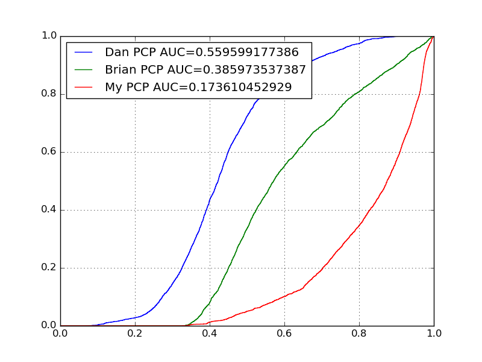
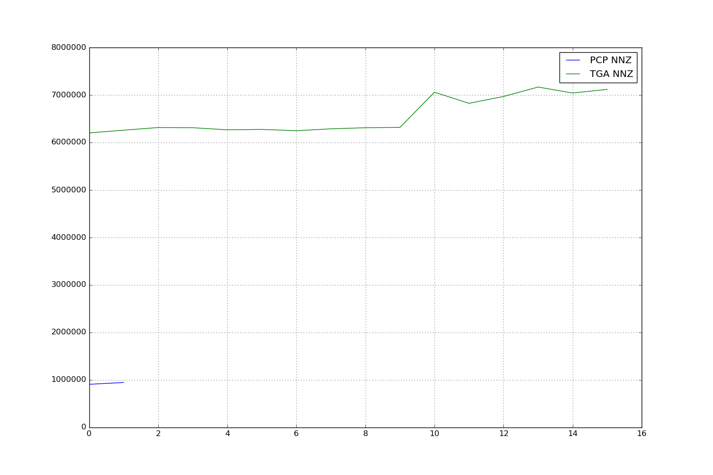
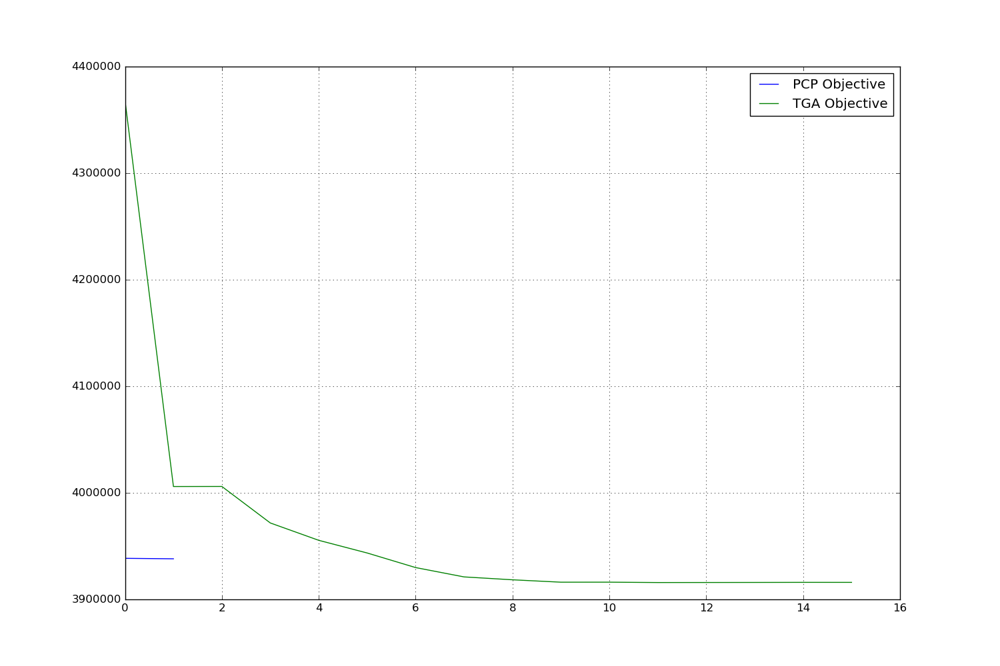
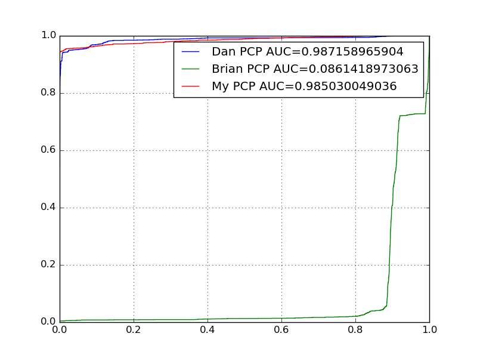
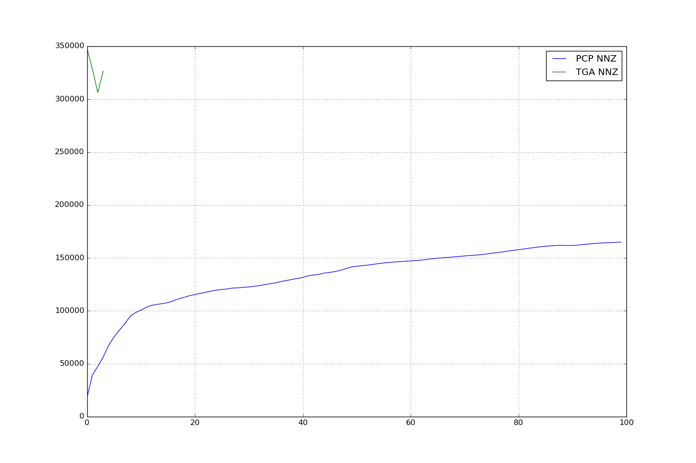
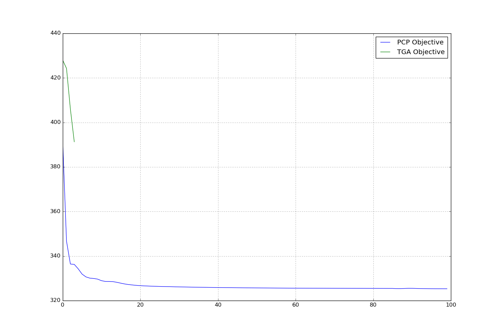
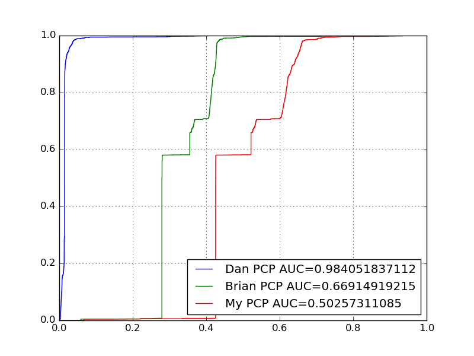
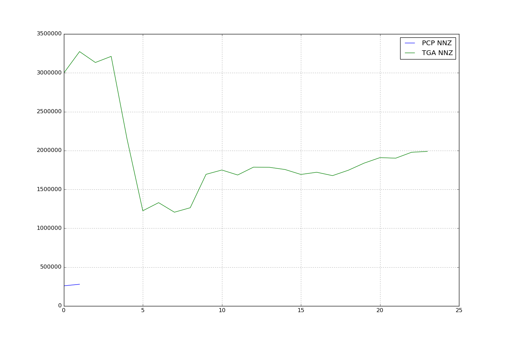
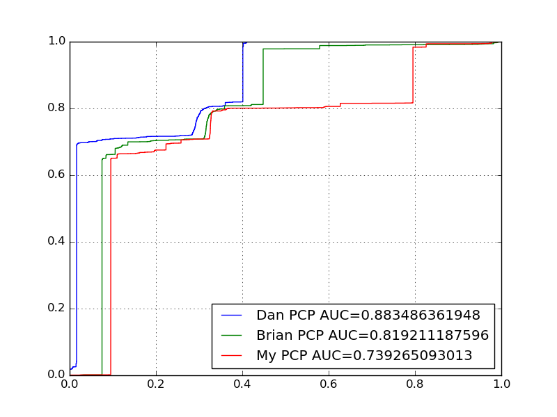
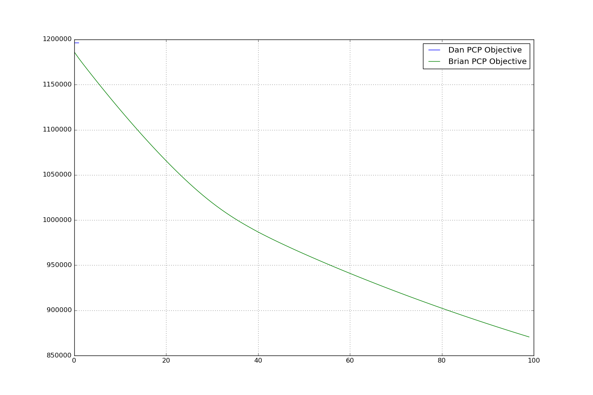

# PCP vs TGA

## Dataset ForestCover

### AUC

### Number of Non Zeros

### Objective

## Dataset Shuttle

### AUC

### Number of Non Zeros

### Objective

## Dataset SA

### AUC

### Number of Non Zeros

### Objective

## Dataset SF

### AUC

### Number of Non Zeros

### Objective
